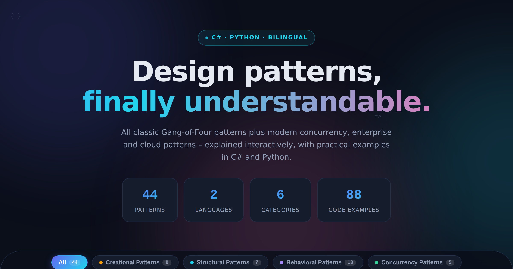

# Design Patterns Interactive – C# & Python

**🌐 Live demo: [apps.totalcreations.de/DesignPatterns](https://apps.totalcreations.de/DesignPatterns/)**

A free, interactive learning tool for software design patterns: **all 23 Gang-of-Four patterns** plus **21 modern patterns** (concurrency, enterprise architecture, cloud resilience) – each pattern with complete code examples in **C# and Python**, bilingual **English/German**.



## ✨ Features

- **44 patterns in 6 categories**: creational, structural and behavioral patterns (GoF) plus concurrency, architecture & enterprise, and resilience & cloud
- **88 code examples** – each pattern idiomatically in C# (with modern features like `Lazy<T>`, records, primary constructors) and Python (duck typing, decorators, generators, `dataclasses`)
- **5 interactive live demos** right in the browser: Observer, Strategy, State, Publish-Subscribe, Circuit Breaker
- Per pattern: intent, **real-world analogy**, when-to-use criteria, pros/cons, related patterns
- **Bilingual** EN/DE toggle, search, category filter, progress tracking
- **A single HTML file** – no dependencies, no CDNs, no trackers
- GDPR/TDDDG-compliant consent banner ("Reject all" equally prominent on the first level)

## 📚 Included patterns

| Category | Patterns |
|---|---|
| **Creational** (9) | Singleton, Factory Method, Abstract Factory, Builder, Prototype, Object Pool, Lazy Initialization, Multiton, Dependency Injection |
| **Structural** (7) | Adapter, Bridge, Composite, Decorator, Facade, Flyweight, Proxy |
| **Behavioral** (13) | Chain of Responsibility, Command, Interpreter, Iterator, Mediator, Memento, Observer, State, Strategy, Template Method, Visitor, Null Object, Specification |
| **Concurrency** (5) | Producer-Consumer, Thread Pool, Future/Promise, Read-Write Lock, Double-Checked Locking |
| **Architectural & Enterprise** (7) | MVC, MVVM, Repository, Unit of Work, Publish-Subscribe, CQRS, Event Sourcing |
| **Resilience & Cloud** (3) | Retry with backoff, Circuit Breaker, Saga |

## 🚀 Self-hosting

Just drop `dist-github/index.html` onto any web space – done. For your own publication you need to add your own legal texts (imprint, privacy policy) – templates are in `src/02_body.html`.

```
dist-github/
├── index.html        # the complete app (single file, without personal legal texts)
├── og-image.png      # social media preview image
├── sitemap.xml       # → /DesignPatterns/sitemap.xml
├── llms.txt          # compact overview for AI search engines
├── llms-full.txt     # full pattern reference for LLMs
└── robots.txt        # → belongs in the DOMAIN ROOT (/robots.txt)
```

Repository: [github.com/HECer/DesignPatterns](https://github.com/HECer/DesignPatterns)

## 🛠 Development

The page is built from partial sources in `src/`. Personal data (imprint etc.) comes from a **gitignored** `personal.config.mjs` (template: `personal.config.example.mjs`) and only ends up in the local `dist/` build – never in the repository:

```bash
node build.mjs   # generates dist/ (live, with real data) + dist-github/ (public)
node verify.mjs  # Playwright smoke test (44 patterns, demos, consent)
```

The consent dialog deliberately uses neutral element names and a fallback so ad-blocker filter lists can't trap the page behind the overlay.

## 📄 License & usage

The code examples may be freely used for learning purposes. Content © see [live site](https://apps.totalcreations.de/DesignPatterns/).
